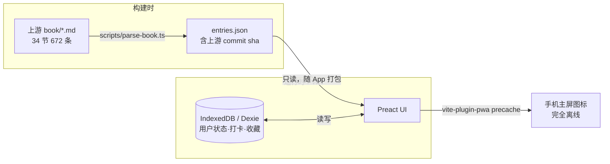

# LiveBetter 设计文档 — 高性价比人生指南 · 自用 PWA

- 日期：2026-10-08
- 状态：设计已获用户批准（brainstorming 出口）
- 路径分类：Architectural（新项目，无现有代码）

## 目的

在 Android 手机上离线使用 [HowToLiveBetter](https://github.com/eternity4719/HowToLiveBetter)（高性价比人生指南：34 节、672 条结构化建议）：

1. 滑卡决定每条建议做不做：**做一次的进清单，要重复做的设为打卡**
2. 打勾清单：标记做到、撤销、删除
3. 分类浏览、收藏、每日一读、全文搜索
4. 完全离线（飞行模式可用）

自用工具：无账号、无后端、不分发。数据源**只用官方仓库 `book/` 目录**（howtolivebetter.net 混有运营者自补内容，不采用；iOS App 为第三方付费产品，仅作功能参考）。

## 已定决策

| # | 决策点 | 结论 | 理由 |
|---|---|---|---|
| Q1 | 平台形态 | Web / PWA | 开发最快、浏览器可验证；Android「添加到主屏幕」即用 |
| Q2 | 内容获取 | 构建时打包进 App | 完全离线、零网络依赖；内容为长期建议，新鲜度不敏感 |
| Q3 | 左滑「不做」语义 | 永久隐藏 + 设置页可反悔 | 符合「决定做不做」定位，误滑可恢复 |
| Q4 | 技术栈 | Vite + Preact + TypeScript + Dexie + vite-plugin-pwa | 组件化开发滑卡/多视图最舒服，依赖极少；滑卡手势用 Pointer Events 手写，不引动画库 |

## 架构



- Vite + Preact SPA，无后端。
- **内容与用户状态彻底分离**：内容是构建产物（只读 `entries.json`），用户状态在 IndexedDB，二者以条目 id 关联。
- 上游更新 = 重新构建部署；用户数据不受影响。

## 数据管线

- `scripts/parse-book.ts`：构建时拉取上游 `book/*.md`，解析产出 `src/data/entries.json`，并把解析时的上游 commit sha 写入 `version`。
- 解析规则（依据上游真实格式）：
  - 条目起始：`### N. 标题`
  - 字段行：`- 成本：` `- 说人话：` `- 收益：` `- 证据等级：` `- 来源：` `- 备注：`
  - 节号：文件名序号（`05-不要浪费钱.md` → sectionId `05`），节标题取文件内标题
- 输出：`{ version: string, sections: Section[], entries: Entry[] }`
- 条目 id：`"05-05"`（`节-条`），稳定且可读。
- 宽容解析：`备注` 等字段可缺；未知行收集为构建 warning，不中断。
- 测试断言：条目数 ≥ 600 且字段结构完整（精确 672 会随上游漂移，不硬编码）。

## 数据模型

| 表 | 主键 | 字段 | 说明 |
|---|---|---|---|
| ContentEntry（JSON，只读） | id | sectionId, sectionTitle, title, cost, plainSpeak, benefit, evidenceGrade, source, note | 「说人话」(plainSpeak) 单独成列——卡片与搜索的主力文本 |
| UserEntry（Dexie） | id | `status: todo/habit/done/rejected`, favorite, decidedAt, doneAt | 一个条目同一时刻只有一个用户状态。**无行 = 未评估（new）**：任何决策才写入行；恢复/删除 = 删行 |
| CheckIn（Dexie） | `id`（entryId+date） | entryId, date(`YYYY-MM-DD` 本地日期) | 连续天数运行时计算，不存冗余；断签即归零，无补签 |
| DailyRead（Dexie） | date | entryId | 按日期种子从「未评估」池随机；同一天刷新不变。若已全部评估，回退到全量池 |

状态机：

```
new（无行）─右滑·选做一次→ todo ─打勾→ done（可撤销回 todo）
new（无行）─右滑·选重复──→ habit（每日打勾/取消）
new（无行）─左滑────────→ rejected（永久隐藏；设置页恢复 = 删行）
todo/habit ─清单删除（删行）→ new（下次滑卡再现）
进度 x/672 = UserEntry 行数 / entries 总数

## 页面与交互（底部 4 Tab）

1. **挑**（默认页）
   - 卡片 deck：标题 + 说人话 + 证据等级徽章；Pointer Events 手写左/右滑。
   - 右滑 → 底部弹层二选一：「做一次 → 进清单」/「要重复 → 设为打卡」。
   - 左滑 → `rejected`，永久隐藏。
   - 顶栏进度 `已评估 x/672`；全部评估完 → 空状态引导去清单/打卡。
   - 顶部常驻**每日一读**卡片，点击进详情。
2. **清单**：`todo` 列表，打勾 → `done` 进折叠「已完成」区（可撤销）；条目左滑删除（回 `new`）。
3. **打卡**：`habit` 列表，今日打勾/取消；每条显示当前连续天数。
4. **浏览**：34 节分组 → 条目详情（全字段 + 收藏星标 + 「加清单/设为打卡」入口）；顶部搜索框，内存全量过滤标题+说人话+收益（672 条无需索引引擎）；收藏视图入口。
5. **设置**：「不做」列表（查看/恢复）；数据导出/导入 JSON（备份决策与打卡记录）。

## 离线与部署

- vite-plugin-pwa：precache 全部资产与 `entries.json`；manifest：standalone、图标、主题色。
- 部署 GitHub Pages；手机 Chrome「添加到主屏幕」。
- SW 自动更新策略：新版本后台安装，前端提示刷新。

## 错误处理

- 解析缺字段不中断（收集 warning）。
- 上游删除条目 → 对应用户状态成孤儿：UI 隐藏，数据保留（不删除）。
- 打卡日期用本地时区 `YYYY-MM-DD` 字符串，跨午夜按本机时区，行为可预期。

## 测试策略

- **vitest 单元**：解析器（真实 md fixture）、连续天数计算、每日一读种子稳定性、搜索过滤。
- **组件测试**（@testing-library/preact）：清单打勾状态流转、滑卡决策落库。
- **人工验证**：开发者用桌面浏览器验证全部 UI 路径；真机离线（Android 飞行模式）由用户最终验证。

## 不做（YAGNI）

- 语义搜索 / embedding
- 账号、云同步、多设备
- 打卡补签
- 证据等级筛选（官网有，v1 不做）
- 多语言翻译版
- Capacitor APK 打包（将来想要再单独立项，不影响当前代码结构）

## 许可

上游内容 CC-BY-4.0、代码 MIT。自用不分发无附加义务；若将来分发，需保留内容署名。
